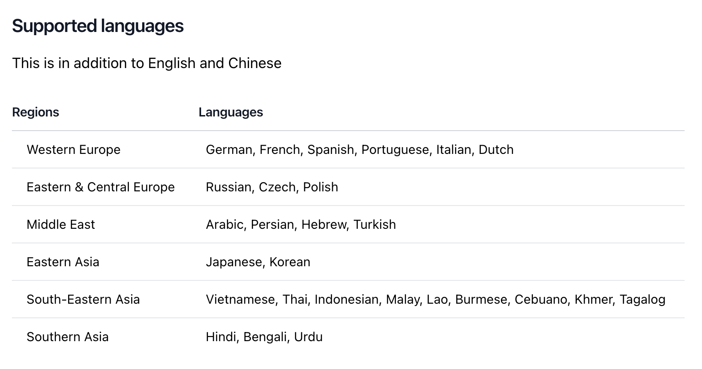
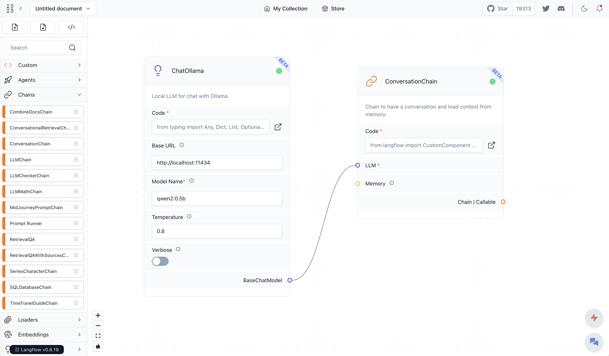
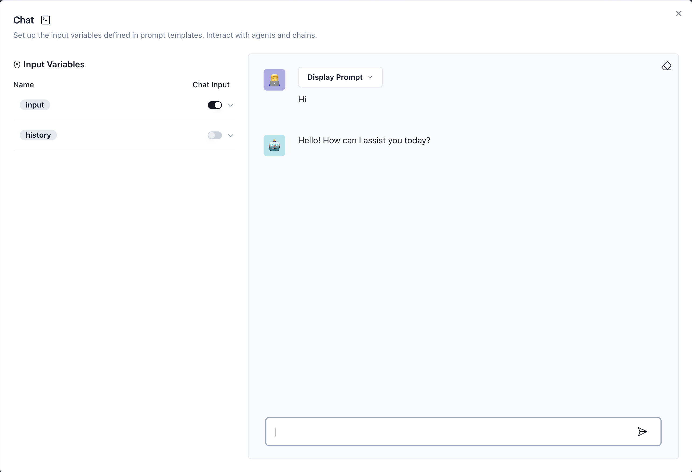

# LLMs

This tutorial shows how to use [Ollama](https://ollama.com/) and [Langflow](https://www.langflow.org/) to create an LLM powered chatbot. Ollama is an application to serve open large language models, while Langflow is an easy low code tool to design LLM applications.

## Pre-requirements

- **Docker**: we will use Docker to run Ollama and serve LLMs. See https://www.docker.com/ for installation steps.
- **Python**: we will use Python 3.10 or later to build applications that use LLMs. You can use https://conda.io/projects/conda/en/latest/index.html or other virtual environment manager.

## Setup

For this tutorial, we will be using a Docker image for Ollama to serve a model from the [Qwen2 series](https://huggingface.co/collections/Qwen/qwen2-6659360b33528ced941e557f) of LLMs released by Alibaba. Ollama provides a series of models out-of-the-box in their website, e.g., https://ollama.com/library/qwen2.

LLMs are a hot topic and there are many other tools and models available to reach a similar outcome.

### Ollama

To run Ollama, you can download the app and install it in your local machine from https://ollama.com/download. But in this tutorial, we will be using a Docker image, see https://ollama.com/blog/ollama-is-now-available-as-an-official-docker-image.

*Note: you can skip the steps related to Docker if you decided to do the full installation of Ollama in your machine.*

We start by pulling the Ollama Docker image. We assume you have Docker installed in your local machine.

```bash
docker pull ollama/ollama
```

Now we can create and run a container for Ollama using port 11434:

```bash
docker run -d -v ollama:/root/.ollama -p 11434:11434 --name ollama ollama/ollama
```

Now that the Docker container is running, we can run an LLM in it --- at least a small one :) In this tutorial, we will be playing with `Qwen/Qwen2-0.5B-Instruct`, which is a small but powerful model with 494M parameters and multilingual capabilities (see [Hugging Face documentation](https://huggingface.co/Qwen/Qwen2-0.5B-Instruct).)

```bash
docker exec -it ollama ollama run qwen2:0.5b
```

After running the previous command, you can interact with the model via your terminal.

```properties
>>> Hi
Hello! How can I assist you today?

>>> Hola
¡Hola! ¿Cómo puedo ayudarte hoy?

>>> Send a message (/? for help)
```



The running model will also be available via API at http://localhost:11434/api/generate and http://localhost:11434/api/chat, for generation and chat interfaces, respectively. See the API configuration at https://github.com/ollama/ollama/blob/main/docs/api.md.

(If you chose a different port in the previous step, then that should be updated here.)

```bash
curl http://localhost:11434/api/generate -d '{
  "model": "qwen2:0.5b",
  "prompt":"Why is the sky blue?"
}'

{"model":"qwen2:0.5b","created_at":"2024-06-21T15:12:17.812648293Z","response":"The","done":false}
{"model":"qwen2:0.5b","created_at":"2024-06-21T15:12:17.846749585Z","response":" reason","done":false}
{"model":"qwen2:0.5b","created_at":"2024-06-21T15:12:17.876334752Z","response":" why","done":false}
{"model":"qwen2:0.5b","created_at":"2024-06-21T15:12:17.902501585Z","response":" the","done":false}
{"model":"qwen2:0.5b","created_at":"2024-06-21T15:12:17.92321046Z","response":" sky","done":false}
{"model":"qwen2:0.5b","created_at":"2024-06-21T15:12:17.952684627Z","response":" is","done":false}
{"model":"qwen2:0.5b","created_at":"2024-06-21T15:12:17.985639877Z","response":" usually","done":false}
{"model":"qwen2:0.5b","created_at":"2024-06-21T15:12:18.019568085Z","response":" blue","done":false}
{"model":"qwen2:0.5b","created_at":"2024-06-21T15:12:18.046722335Z","response":" is","done":false}
...
```

```bash
curl http://localhost:11434/api/chat -d '{
  "model": "qwen2:0.5b",
  "messages": [
    { "role": "user", "content": "why is the sky blue?" }
  ]
}'

{"model":"qwen2:0.5b","created_at":"2024-06-21T15:14:43.949890125Z","message":{"role":"assistant","content":"The"},"done":false}
{"model":"qwen2:0.5b","created_at":"2024-06-21T15:14:44.009230583Z","message":{"role":"assistant","content":" reason"},"done":false}
...
```

At this point, you have access to an LLM in your local machine that can be used to build applications! :rocket:

To stop the container at any moment, type the following:

```bash
docker stop ollama
```

### Langflow

Given the LLM availability through an API, there are different ways to build applications. Here we will use Langflow, which is a visual framework to design LLM pipelines.

This is a Python package that you can install using:

```bash
python -m pip install langflow -U
```

Then, you can run Langflow with:

```bash
python -m langflow run

╭───────────────────────────────────────────────────╮
│ Welcome to ⛓ Langflow                             │
│                                                   │
│ Access http://127.0.0.1:7860                      │
│ Collaborate, and contribute at our GitHub Repo 🚀 │
╰───────────────────────────────────────────────────╯
```

You can see that Langflow has created a URL to access their UI from your browser. Go ahead and open this URL and click on the "New Project" button to create a new flow.

The UI allows drag-and-drop of predefined blocks to a canvas. There many example flows available in their store and in their Hugging Face Space, https://huggingface.co/spaces/Langflow/Langflow.

To build our minimalist bot, we need just two blocks:



To recreate this you can follow these steps:

1. From the left menu, select "Chains" and "ConversationChain". Drag that to the canvas.
2. From the left menu, select "LLMs" and "ChatOllama". Drag that to the canvas.
3. In the "ChatOllama" fill the base URL field with `http://localhost:11434` and the model name with `qwen2:0.5b`.
4. Connect the blocks by creating a connection from "BaseChatModel" to "LLM".
5. Click on the lightning icon on the bottom-right to validate your pipeline.
6. Click on the chat icon on the bottom-right to test the bot.



:tada: Congrats! you have created an LLM powered chatbot.

Feel free to explore and test other blocks available in Langflow to build more complex applications.
